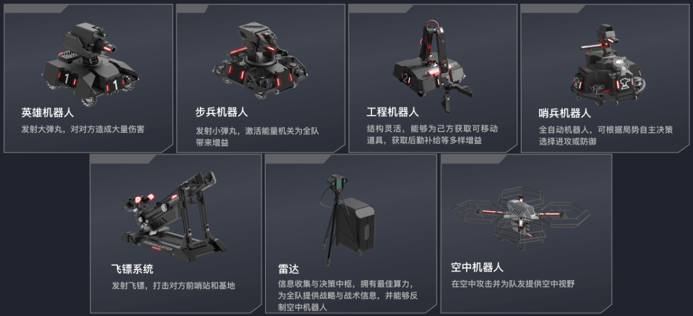

# 战队概述

# 团队性质

复旦大学星云EGA机器人战队是一支**专注全国机器人大赛RoboMaster机甲大师赛和机器人技术研发的竞赛队伍**，成立于2024年9月13日由**未来信息创新学院黄奇伟老师**发起，由**五星级社团电子创客社团\(EGA\)**孵化，并得到**未来信息创新学院、校团委、教务处**的大力支持。战队立足于学校工科和交叉学科发展，致力于为对机器人技术感兴趣的同学提供一个锻炼工程能力的实践平台。

战队名字中的“**星云**”灵感来自于复旦录取通知书中“**祝贺你跻身百年复旦的星空**”，EGA来源于电子创客社团的英文名"Electronic Geek Association"，并重新诠释为"Elite Geek Association"，意为汇聚精英，勇攀高峰。未来，战队希望向全校同学科普机器人技术，让更多同学了解RM赛事并有机会参与进来，让战队成为复旦百年星空里一朵璀璨的星云。

# 历史起源

**复旦大学星云EGA****机器人****战队**成立于2024年9月，在信息学院老师的场地和经费支持下开展备赛工作，作为新队伍参加2025赛季的高校联盟赛。战队由信息学院黄奇伟老师、电子创客社团往届社长黎林、张安同学发起，25赛季以“EGA”作为队名报名RoboMaster高校联盟赛（上海站），后经商讨将队名修改为“星云EGA”。

星云EGA战队并非复旦首个参与RoboMaster赛事的战队，在2020年至2022年期间，名为Romantic的战队曾代表复旦参加人工智能挑战赛（RMUA），但由于赛事变动和战队传承问题，该战队目前已解散。Romantic战队留下的硬件设备，成为了星云EGA战队的物质基础。

新成立的星云EGA战队由复旦大学电子创客社团核心成员发起，电创社目前是复旦最大的电子科技类社团，2024年、2025年获校级五星社团荣誉称号。社团近三年广泛开展智能硬件科普实践活动、参与电赛、光电赛等学科竞赛培训工作，汇聚了一批技术能力出众的同学，已具备自主研发机器人的实力。于是社团骨干向相关负责老师表达了重新组建RM战队的意愿，获得了老师的大力支持，由此星云EGA战队诞生。

# 队伍文化

**筚路蓝缕，以启山林。**

> 出自《左传》，原意为驾着简陋的车，穿着破烂的衣服去开辟山林。形容创业的艰苦。这句话来自于战队的前身电子创客社团。无论是电创社还是星云EGA战队，都在各自的领域经历了“从沙漠中开垦江河”的艰苦过程。
> 
> "筚路蓝缕，以启山林"不仅是刻在青铜器上的古老箴言，更是流淌在EGA血脉中的创新基因。如今的机甲轰鸣声中，我们依然能听见当年接通第一根导线时的震颤——这是属于开拓者的永恒频率。
> 
> 

**死战不退！**

> 2025赛季的联盟赛上海站中，时任导航负责人沈嘉竣为哨兵编写了这样一个策略：当比赛剩余时间不足10秒时，哨兵无论血量多少，均不再回城，此时哨兵命令行中将输出“比赛即将结束，死战不退”。这句话成为了我们25赛季的强心剂。
> 
> "死战不退"是星云EGA战队用焊锡与代码浇筑的无畏精神。它不是鲁莽的冲锋，而是精密计算后的孤勇。星云EGA将时刻具有破釜沉舟的勇气，用最后一颗弹丸丈量尊严的射程。
> 
> 

# 机器人命名渊源

2024年11月，正值25赛季的报名时间，领队黄奇伟老师与当时的队长张安及当时的项管黎林就队伍名称进行了一番讨论，提出过以"**璇玑**"作为战队名称，寓意RM之道处处玄机，也符合复旦大学的人文之风。但是鉴于25赛季的队名"**EGA**"已经提交系统，改名字需要联系赛务比较麻烦，并且后续又有更加具备寓意的"**星云**"作为队名，最终并没有采用该方案。但是"**璇玑**"随即成为了机器人命名的创意。

RoboMaster机甲大师高校系列赛里的最高规格的比赛是超级对抗赛（RMUC），需要战队研发7种不同功能定位和机制的机器人，即：英雄机器人、步兵机器人、工程机器人、哨兵机器人、飞镖系统、雷达系统、空中机器人，因此RMUC也被俗称为7V7。正如战队的名字为星云，而星空中众多星云里，最为众人熟知且亮眼的正是**北斗七星，**因此我们借用了北斗七星的名字，作为星云EGA战队的7种机器人的名字，这一命名系统同样与战队名字以及复旦的人文气息遥相呼应。

北斗七星各星之名，始见于汉代纬书《春秋运斗枢》：“斗第一天枢，第二璇，第三玑，第四权，第五衡，第六开阳，第七摇光。第一至第四为魁，第五至第七为杓，合而为斗，居阴布阳，故称北斗。”北斗七星的斗身，由天枢、天璇、天玑、天权组成，古曰魁，是北斗七星的主星，因此我们用其命名RM赛场上最核心的4种机器人——英雄、步兵、工程和哨兵；而北斗七星的斗柄，由玉衡、开阳、摇光组成，古曰杓，则作为另外3种相对机器人的命名——飞镖、雷达和空中。

道教称北斗七星为七元解厄星君，居北斗七宫，即：天枢宫贪狼星君、天璇宫巨门星君、天玑宫禄存星君、天权宫文曲星君、玉衡宫廉贞星君、开阳宫武曲星君、瑶光宫破军星君。根据各个星宿的象征寓意，以及7个兵种的机器人各自在RM赛场上的定位，最终确定了各个机器人的命名。

|**星名**|**术数名**|**星宿寓意及对应关系**|**兵种**|
|---|---|---|---|
|天枢|贪狼星|多才多艺、足智多谋，象征创造力和领导能力；步兵机器人的定位是突袭、绕后及组织协同进攻，同时为了纪念步兵机器人是战队的第一台机器人，因此以天枢命名|步兵机器人|
|天璇|巨门星|心思细密，善于思考，象征策略和思考；英雄机器人是RMUC中针对建筑物的主要攻击单位，需要抓准时机以及沉着调整才能打出足够的伤害，同时为了纪念英雄机器人是战队的第二台机器人，因此以天璇命名|英雄机器人|
|天玑|禄存星|被尊为财富昌盛之星，象征资源和财富；工程机器人是赛场上最主要的经济获取单位，担负起整局比赛中队伍在对战系统里的金币来源，因此以天玑命名|工程机器人|
|天权|文曲星|聪明才智的代表，象征智慧与才华；哨兵机器人是赛场上唯一的全自动的机器人，集齐了定位导航、自主决策、自动瞄准开火等各种人工智能的技术，因此以天权命名|哨兵机器人|
|玉衡|廉贞星|负责尽职，见识不凡，是非分明；雷达系统是赛场上用于监测全场，解析敌方电磁波，识别敌方单位并持续定位，以向队伍提供赛场信息的系统，因此以玉衡命名|雷达系统|
|开阳|武曲星|武力与决断的代表，象征战斗力和行动力，该星宿明亮且伴有辅星；空中机器人是目前赛场上唯一一个双人控制的机器人，一个负责移动一个负责开火，很符合开阳有辅星的特点；同时空中机器人既能提供全场的火力支援，又能提供视野，是兼具战斗力和战略意义的兵种，因此以开阳命名|空中机器人 |
|摇光|破军星|变革与破局的象征，代表破阵与颠覆，并且伴随着冒险；飞镖系统由于命中难度大，可用次数少，具有极高的伤害，但是容错率极低，时常成为扭转战局的神之一手，同时也是技术含量最高的兵种之一，因此以摇光命名|飞镖系统 |

